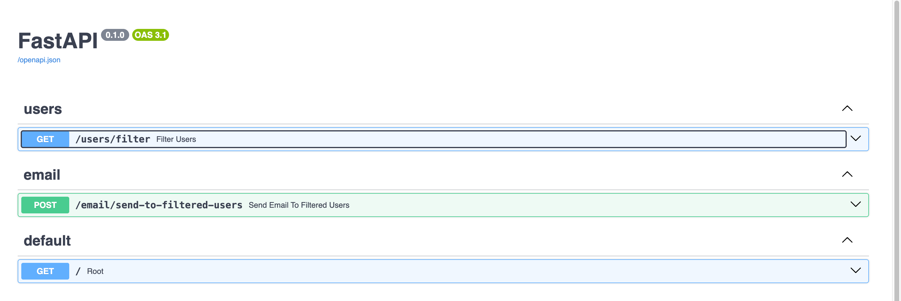
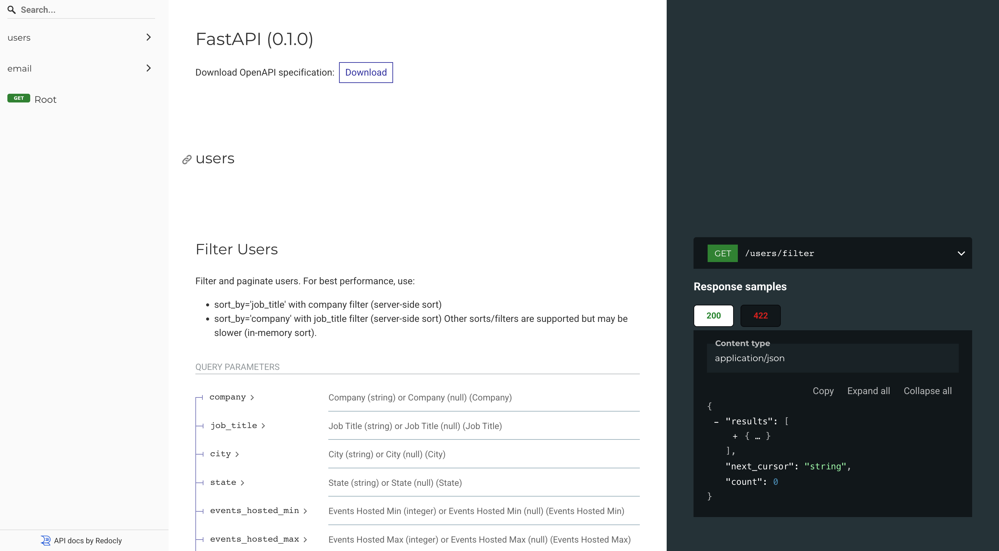

# event-management-crm

[](https://github.com/quang-ng/employee-search-service/actions/workflows/ci.yml)

## Architecture Decisions

- **Framework**: FastAPI for building RESTful APIs.
- **Database**: AWS DynamoDB for scalable, serverless NoSQL storage.
- **Containerization**: Docker for consistent development and deployment environments.
- **Testing**: Pytest for unit and integration tests.
- **Modular Design**: Separated concerns into routers, services, models, schemas, and utilities for maintainability.

## Project Structure

```
├── app/
│   ├── main.py               # FastAPI app entry point
│   ├── init_dynamodb.py      # DynamoDB initialization
│   ├── models/               # Pydantic and DB models
│   ├── routers/              # API route definitions
│   ├── schemas/              # Request/response schemas
│   ├── services/             # Business logic
│   ├── utils/                # Utility functions (DB, email, logger)
│   └── tests/                # Test suite
├── requirements.txt          # Python dependencies
├── Dockerfile                # Docker build file
├── docker-compose.yml        # Multi-container orchestration
└── README.md                 # Project documentation
```

## API Endpoints


### User Filter

- `GET /users/filter` — Filter and paginate users

#### Description
Returns a paginated list of users matching the provided filters. **No authentication is required.**

#### Query Parameters
- `company` (string, optional): Filter by company name
- `job_title` (string, optional): Filter by job title
- `city` (string, optional): Filter by city
- `state` (string, optional): Filter by state
- `events_hosted_min` / `events_hosted_max` (int, optional): Min/max events hosted
- `events_attended_min` / `events_attended_max` (int, optional): Min/max events attended
- `limit` (int, optional, default=100, max=200): Max results per page
- `cursor` (string, optional): Pagination cursor
- `sort_by` (string, optional): Field to sort by (e.g., `company`, `job_title`, etc.)
- `sort_order` (string, optional, default=`asc`): `asc` or `desc`

#### Example with curl

```sh
# Get users in company "Acme Corp" who are hosts, sorted by job_title
 curl -s "http://localhost:8000/users/filter?company=Acme%20Corp&sort_by=job_title&role=host&limit=5"  | jq
```

#### Example Response
```json
{
  "results": [
    {
      "id": 1,
      "email": "alice@acme.com",
      "first_name": "Alice",
      "last_name": "Smith",
      "role": "host",
      "company": "Acme",
      "job_title": "Manager",
      "city": "New York",
      "state": "NY",
      "events_hosted": 3,
      "events_attended": 10,
      "phone_number": null,
      "avatar": null,
      "gender": null
    }
    // ...more users
  ],
  "next_cursor": "...",
  "count": 5
}
```


### Email

- `POST /email/send-to-filtered-users` — Send an email to users matching filter criteria

#### Description
Sends an email to all users matching the provided filters (same as `/users/filter`). The email sending is performed asynchronously using FastAPI's `BackgroundTasks`, so the API responds immediately while emails are sent in the background.

#### Request Body
- `subject` (string, required): Email subject
- `body` (string, required): Email body

#### Query Parameters
Same as `/users/filter` (e.g., `company`, `job_title`, `city`, `state`, `events_hosted_min`, etc.)

#### Example with curl
```sh
curl -X POST "http://localhost:8000/email/send-to-filtered-users?company=Acme%20Corp&limit=5" \
     -H "Content-Type: application/json" \
     -d '{"subject": "Hello!", "body": "Welcome to Acme."}' | jq
```

#### Example Response
```json
{
  "message": "Emails sent to 2 users."
}
```

#### Background Task
This endpoint uses FastAPI's `BackgroundTasks` to schedule the actual email sending. 


**Background Task Logic:**

1. For each recipient, a new email log is created in the `email_logs` DynamoDB table with status `pending`.
2. The system attempts to send the email (simulated, with a 30% chance of failure for demonstration).
3. If sending succeeds, the log is updated to status `sent` and a `sent_at` timestamp is recorded.
4. If sending fails, the log is updated to status `failed`, with a `failed_at` timestamp and error message.
5. All email sending and logging is performed asynchronously in the background, so the API responds immediately.

**Example email log entry:**
```json
{
  "sent_at": "2025-07-22T08:15:16.935734",
  "subject": "Hello!",
  "recipient": "bob@example.com",
  "created_at": "2025-07-22T08:15:16.929429",
  "id": "9c4405b2-2475-4600-8402-ae2ce312524f",
  "body": "Welcome to Acme ",
  "status": "sent"
}
```

See `app/utils/email_utils.py` for implementation details.

## OpenAPI & API Documentation

This project uses FastAPI, which automatically generates interactive API documentation using the OpenAPI standard. You can explore and test all endpoints directly in your browser.

- **Swagger UI**: [http://localhost:8000/docs](http://localhost:8000/docs)



- **ReDoc**: [http://localhost:8000/redoc](http://localhost:8000/redoc)


The documentation is always up-to-date with your code and includes request/response models, authentication, and error responses.


## Unit Tests

This project uses **pytest** and **pytest-asyncio** for unit and integration testing. Tests are located in the `app/tests/` directory and cover routers, services, and utilities.


### Running All Tests

```sh
cd app/tests
python run_test.py
```

### Run with Coverage Report

```sh
cd app/tests
python run_test.py --cov
```

### Run a Specific Test File

```sh
cd app/tests
python run_test.py test_email.py
```

### Requirements

Install dependencies (if not already):

```sh
pip install -r ../../requirements.txt
```

You may also need:

```sh
pip install pytest pytest-asyncio
```

---

## AI Tools & Best Practices

### What AI tools do our developers use?
- **Cursor with GPT-4.1 model of OpenAI**: For code completion, suggestions, and boilerplate generation.

### How do these tools assist?
- **Coding**: Suggest alternative implementations, and help generate repetitive code structures, speeding up development.
- **Debugging**: Developers use AI chat assistants to explain error messages, suggest fixes, and analyze stack traces.
- **Testing**: AI can help generate test cases, review test coverage, and suggest edge cases.
- **Documentation**: Tools like ChatGPT help me in drafting and refining documentation, README sections, and code comments.

### Best Practices for AI Tool Usage
- **Review All AI-Generated Code**: Always review, test, and understand code suggested by AI before merging.
- **Use AI for Ideation, Not as a Source of Truth**: Treat AI suggestions as starting points, not final answers.
- **Maintain Security & Privacy**: Never share sensitive code, credentials, or proprietary data with external AI tools.
- **Document AI-Assisted Changes**: Note in PRs or commit messages when significant code was generated or heavily influenced by AI.
- **Continuous Learning**: Stay updated on AI tool capabilities and limitations to maximize productivity and code quality. 